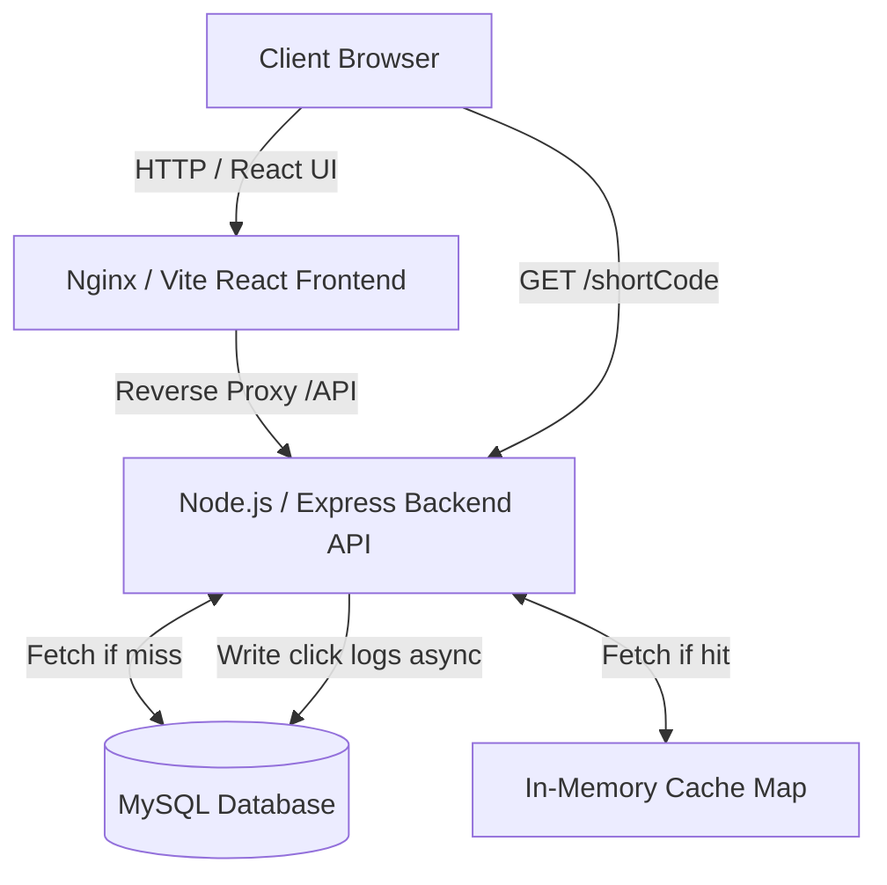

# URL Shortener SaaS Platform

A production-ready robust URL Shortener platform built with Node.js, Express, React, and MySQL. Provides blazing fast redirection, custom short-links code, URL expiration, rate limiting, and comprehensive link analytics (clicks timeline, geospatial data, and device tracking).

## Architecture



## Setup Instructions

### 1. Prerequisites
- Docker and Docker Compose
- Node.js 18+ (for local development)

### 2. Quick Start with Docker (Recommended)
You can launch the entire stack (Database, Backend API, Frontend React app) using Docker Compose.

```bash
cd url-shortener
docker compose up -d
```
The application will be available at:
- **Frontend Dashboard:** `http://localhost:3000`
- **Backend API:** `http://localhost:5000`
- **Redirect Base:** `http://localhost:5000/:shortCode`

### 3. Manual Development Setup

#### Backend Setup
```bash
cd backend
npm install
# Set up .env variables (DATABASE_URL, etc.)
npx prisma generate
npx prisma db push
npm run dev
```

#### Frontend Setup
```bash
cd frontend
npm install
npm run dev
```

## API Documentation

### Auth
- `POST /api/auth/register` - Register a new user (`email`, `password`)
- `POST /api/auth/login` - Login to account (`email`, `password`)
- `GET /api/auth/me` - Get current session user

### URLs
- `POST /api/url/create` - Create a short link (`originalUrl`, optional `customCode`, optional `expirationDate`)
- `GET /api/url/list` - Get all short links for current user
- `DELETE /api/url/:id` - Delete a URL

### Analytics
- `GET /api/analytics/:id` - Fetch detailed click analytics for a specific URL

### Redirection
- `GET /:shortCode` - Top-level route that redirects the user to the original destination while tracking the click asynchronously.

## Database Schema Highlights
The database uses Prisma ORM on top of MySQL.

- **User**: Stores emails and encrypted passwords.
- **Url**: Stores `originalUrl`, `shortCode`, `expirationDate`. Linked to User.
- **Click**: Logs every visit. Tracks `ipAddress`, `location`, `browser`, `os`, `device`.
- **Analytics**: Aggregated view table storing `totalClicks`, `uniqueClicks`.

## Postman Collection
A `Postman_Collection.json` file is located in the root directory. Import it into Postman to easily test the API endpoints. Variables like `{{baseUrl}}` and `{{jwtToken}}` are pre-configured.
